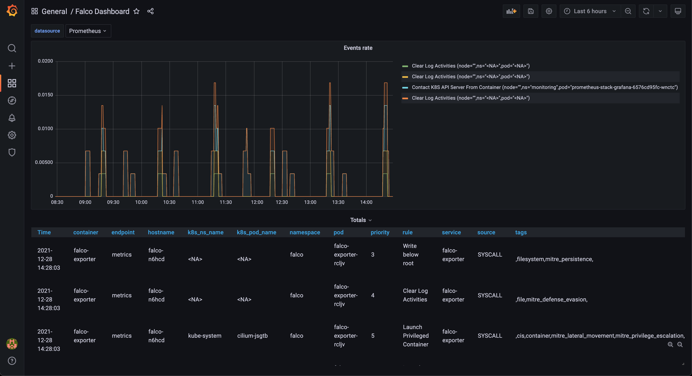
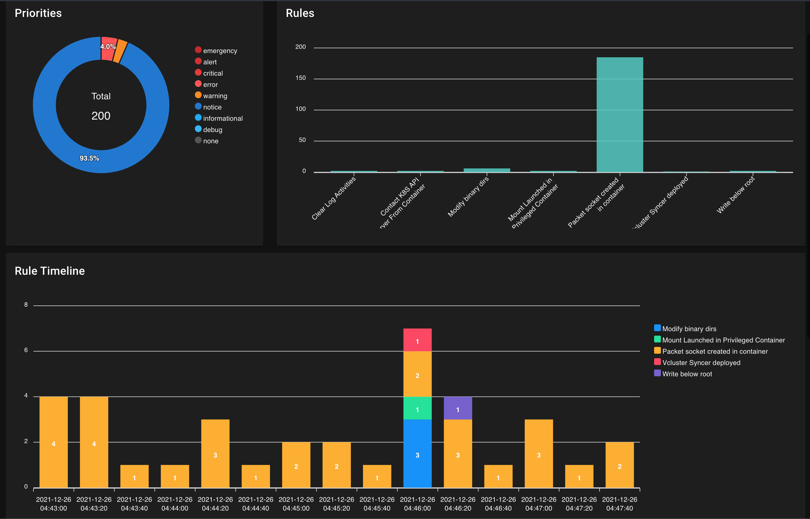

# do-kube-challenge
My writeup for the DigitalOcean Kubernetes Challenge.

## Selected Challenge
My background is in security, so the security and compliance related challnge immediately caught my eye. The exact challenge is as follows:

> Deploy a security and compliance system
When you deploy an image you may also deploy a security threat, and images can become quickly insecure as new threats are discovered and disclosed. To continuously monitor and detect threats, you can deploy a tool like Falco.

I have heard of Falco before, so this seemed like a perfect chance to get some exposure to it.

## Cluster Creation
I had initially created my Kubernetes cluster manually, but eventually migrated it over to terraform. You can see my terraform code in [`do.tf`](do.tf).

## Helm Charts
When I went to the page in the DigitalOcean console for my cluster, I saw some 1 click deployment options for things like metrics and log collection. While these are certainly useful features, I never really got the experience doing this myself using `helm`. I decided to rebuild my cluster and do this all from scratch myself.

From my commit history, you can see that I had initially done my helm charts using [`helmfile`](https://github.com/roboll/helmfile). While this was a good learning experience, I swapped over to terraform once I learned there was a helm provider for terraform. You can see my final charts in [`helm.tf`](helm.tf).

My first few charts were the `metrics-server` and the `kube-prometheus-stack` for Prometheus and Grafana. These gave me great cluster visibility and monitoring. I also tried my hand at deploying `loki` for log aggregation and querying.

Now it was time to get to deploying Falco. I followed the [documentation](https://github.com/falcosecurity/charts/tree/master/falco) for Falco's helm chart and also the [documentation](https://github.com/falcosecurity/charts/tree/master/falco-exporter) for falco-exporter in order to accomplish this. I also read this [Falco Blog Post](https://falco.org/blog/falco-kind-prometheus-grafana/) to help me along the way. It mentioned needing to set up certifiicates for mutual TLS but this wound up not being needed for me as the dashboard and alert forwarding worked just fine without it as long as I asked falco-exporter to create a Service Monitor for prometheus to collect events from. You can see my full values for [falco](values/falco.yaml) and [falco-exporter](values/falco-exporter.yaml).

After deploying falco I noticeed a lot of alerts about Cilium pods creating "Packet Sockets" constantly. Given that Cilium is a CNI, I figured this was a false positive and added cilium to a list of known binaries that create packet sockets. The packet socket rule already has a suppression of this list so the following definition stopped the alerts:

```yaml
- list: user_known_packet_socket_binaries
  items: [cilium-agent]
```

Here is a screenshot of the falco dashboard in falco:



## Taking it further
I looked at the other challenges and saw one about vcluster. I read up on vcluster and thought it was an interesting approach to multi-tenancy on Kubernetes. I also had the idea that a security team would want to know if a vcluster had been deployed in a namespace without their approval or knowledge. This potentially opens another path to scheduling pods on the cluster even though many resources are synced. As a result, I decided to write a rule to detect the deployment of a vcluster through detection of its syncer container. The rule is defined as follows:

```yaml
- rule: Vcluster Syncer deployed
  desc: Detect a when a vcluster has been deployed into a namespace
  condition: container_started and container and container.image.repository endswith "loftsh/vcluster"
  output: A VCluster syncer has been deployed (k8s.ns=%k8s.ns.name k8s.pod=%k8s.pod.name container.id=%container.id)
  priority: WARNING
```

I used this rule and then created a vcluster using their helm chart. The rule worked great and can be seen in falco-sidekick's UI below:

